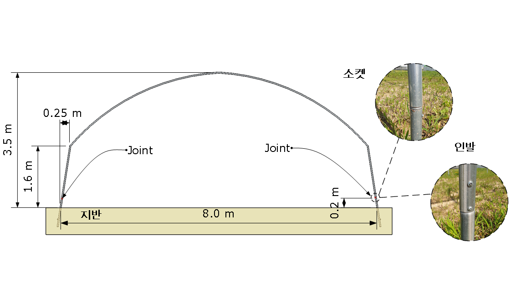
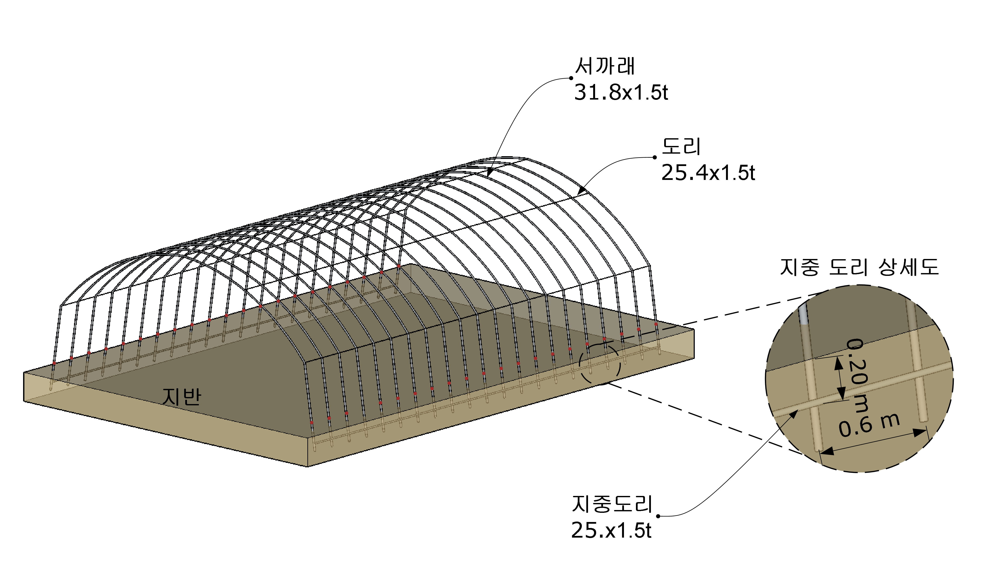
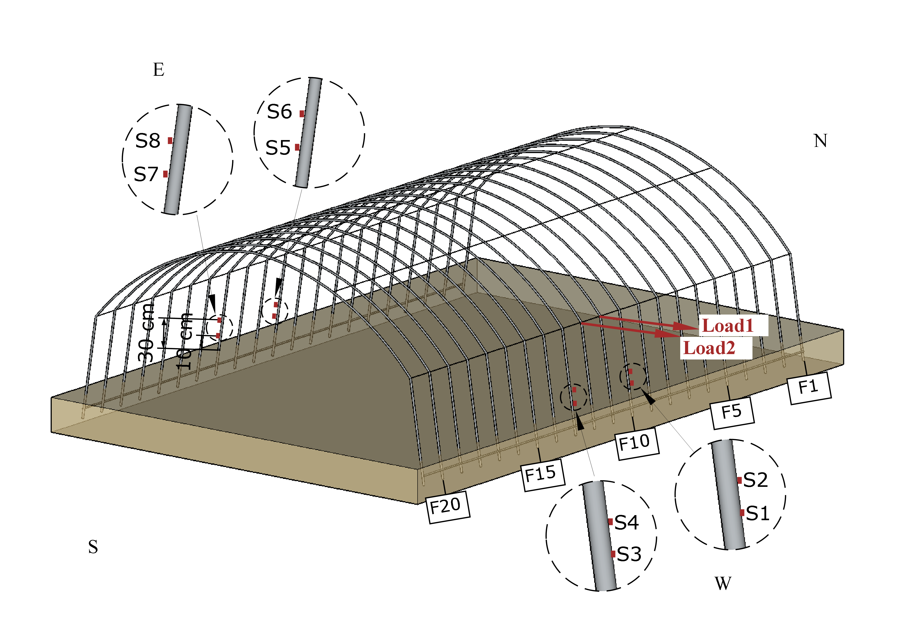

```{r setup, include=FALSE}
library(flexdashboard)
library(rmarkdown)
library(ggplot2)
library(lubridate)
library(dplyr)
library(readr)
library(gridExtra)
library(tidyr)
library(knitr)
library(png)
library(extrafont)
library(ggthemes)
library(doBy)
library(kableExtra)


knitr::opts_chunk$set(echo = FALSE, message = FALSE, warning = FALSE)

```


## Row 1 {data-height=17}

###

<table style="width:100%">
<tr>
    <td align="center" rowspan="2">
     </img> 
    </td>
    
   <td>
    <center><h3>**현장실험을 통한 온실의 구조성능평가**</h3></center>  
    
  <center><h3>**Structural Performance Evaluation of Greenhouses by Field Load Test**</h3></center>
  </td>
  
  <td rowspan="2">
   </img>
  </td>
</tr>

<tr>
  <td>
  <center><u>최만권</u>·류희룡<sup>*</sup>·조명환·유인호·김승유<br>시설원예연구소</center>
  </td>
</tr>
</table> 

<hr>

**연구의 목적**

- 부재 접합(인발 및 소켓)형식에 따른 구조성능 차이 분석
- 현장 재하시험을 통한 온실 구조성능 평가 <div style="float:right; text-align:center"><sup>*</sup>baradori@korea.kr </div>

## Row 2 {data-height=71}

### **재료 및 방법**{data-width=30}

####

**실험체 개요**

- 실험체 수: 2동(인발 및 소켓형식  실험체)
- 실험체 규격: 10-단동-5형 (측고 1.6, 동고 3.5, 폭 8.2, 서까래 간격 0.6m)
- 실험체 강관 치수:  서까래 φ31.8x1.5t, 도리 φ25.4x1.5t

####
**Table. 1. 실험체 목록**

```{r}
df <- tribble(
  ~"실험체명", ~"접합형식",
  "Experment I", "인발",
  "Experment II", "소켓"
)
kable(df, aling=c("c"))%>%
  kable_styling()
```

####
**Fig.1. 실험체 모식도**

  {width=90%}
  <center>**2D**</center>
####

  {width=90%}
  <center>**3D**</center>
####

**센서설치**

- 변형률 측정: 스트레인 게이지 8개 설치 
- 하중 측정:   로드셀 가력기 선단부에 1개 설치 


### **결과**{data-width=30}

####

**Fig. 3. 하중-변위 그래프 (인발형식 실험체)**

```{r, fig.width= 3.5, fig.height=3, fig.align='center'}
df_TMR1<- read_csv("D:/Project/Field_test/Data/field exp_TMR pull only.csv") #하중-응력 그래프용
df_TMR<- read_csv("D:/Project/Field_test/Data/field exp_TMR.csv")
df_COM<- read_csv("D:/Project/Field_test/Data/field exp_COM.csv")

g1<- ggplot(df_COM)+geom_line(aes(Draw_Disp2, Draw_Load2, col="Draw_Load2"), size=1.2)+
  geom_line(aes(Draw_Disp3, Draw_Load3, col="Draw_Load3"), size=1.2)+
  geom_segment(aes(x=0, xend=50.3, y=0, yend=445), color="red", size=1, linetype="dotted")+
  geom_segment(aes(x=0, xend=50.3, y=0, yend=440), color="blue", size=1, linetype="dotted")+
  geom_segment(aes(x=0, xend=150, y=0, yend=1047), color="red", size=1, linetype="dotted")+
  geom_segment(aes(x=0, xend=150, y=0, yend=1032), color="blue", size=1, linetype="dotted")+
  scale_colour_discrete(name="Load position", labels=c("Load 1", "Load 2"))+
  xlab("Displacement (mm)")+ylab("Load (N)")+
  ylim(0,1200)+
  theme_classic()+
  theme(
    axis.title = element_text(size=12),
    axis.text = element_text(size=10),
    legend.text=element_text(size=10),
    legend.title=element_blank(),
    legend.key.height = unit(0.8, "cm"),
    legend.key.width =  unit(0.8, "cm"),
    legend.position = "top",
    panel.background = element_blank())
g1
```


####
**Fig. 4. 하중-변위 그래프 (소켓형식 실험체)**

```{r, fig.width= 3.5, fig.height=3, fig.align='center'}

g2<- ggplot(df_COM)+geom_line(aes(Pin_Disp2, Pin_Load2, col="Pin_Load2"), size=1.2)+
  geom_line(aes(Pin_Disp3, Pin_Load3, col="Pin_Load3"), size=1.2)+
  geom_segment(aes(x=0, xend=50.2, y=0, yend=418), color="red", size=1, linetype="dotted")+
  geom_segment(aes(x=0, xend=50.1, y=0, yend=408), color="blue", size=1, linetype="dotted")+
  geom_segment(aes(x=0, xend=150, y=0, yend=1010.0), color="red", size=1, linetype="dotted")+
  geom_segment(aes(x=0, xend=150, y=0, yend=1077.0), color="blue", size=1, linetype="dotted")+
  scale_colour_discrete(name="Loa
                        d position", labels=c("Load 1", "Load 2"))+
  xlab("Displacement (mm)")+ylab("Load (N)")+
  ylim(0,1200)+
  theme_classic()+
  theme(
    axis.title = element_text(size=12),
    axis.text = element_text(size=10),
    legend.text=element_text(size=10),
    legend.title=element_blank(),
    legend.key.height = unit(0.8, "cm"),
    legend.key.width =  unit(0.8, "cm"),
    legend.position = "top",
    panel.background = element_blank())

g2
```

####

**Table. 2. 실험체별 횡강성 비교**
```{r}
tribble(
  ~"변위 (mm)", ~"인발형식 (N/mm)", ~"소켓형식 (N/mm)",
  "50.3", 8.84, 8.33,
  "100.0", 7.57, 7.26,
  "150.0", 6.98, 6.73) %>%
  kable(align = c("c")) %>% kable_styling()

```


### **결과**{data-width=30}

####

**Fig. 6. 하중-응력 그래프 (인발형식 실험체)**

```{r, fig.width= 3.5, fig.height=3, fig.align='center'}

df_TMR1<- mutate(df_TMR1, 
                time=rep(1:50, len=length(df_TMR1$Draw_LOAD2)),
                time1=rep(1:50, len=length(df_TMR1$Pin_LOAD2)))
df_TMR_Draw<- df_TMR1 %>% mutate(
              S1=(Draw_STN01)*0.2, S2=(Draw_STN02)*0.2,
              S3=(Draw_STN03)*0.2, S4=(Draw_STN04)*0.2,
              S5=(Draw_STN05)*0.2, S6=(Draw_STN06)*0.2,
              S7=(Draw_STN07)*0.2, S8=(Draw_STN08)*0.2)%>%
              filter(time==1) %>%
              select(Draw_LOAD2, S1:S8)%>%
              gather(type, value, -Draw_LOAD2) %>%
              ggplot(aes(value, Draw_LOAD2, col=type))+
              geom_path(size=1)+
              geom_point(size=1.5)+
              ylab("Load (N)")+xlab("Stress (MPa)")+ xlim(-120, 120)+
              theme_classic()+
              theme(axis.title = element_text(size=12),
                    axis.text = element_text(size=10),
                    strip.text = element_text(size=10),
                    legend.position = "top",
                    legend.text = element_text(size=10),
                    legend.title = element_blank())+
              guides(color=guide_legend(nrow=2))

df_TMR_Draw

```

####

**Fig. 6. 하중-응력 그래프 (소켓형식 실험체)**

```{r, fig.width= 3.5, fig.height=3, fig.align='center'}
df_TMR_Pin<- df_TMR1 %>% mutate(
              S1=(Pin_STN01)*0.2, S2=(Pin_STN02)*0.2,
              S3=(Pin_STN03)*0.2, S4=(Pin_STN04)*0.2,
              S5=(Pin_STN05)*0.2, S6=(Pin_STN06)*0.2,
              S7=(Pin_STN07)*0.2, S8=(Pin_STN08)*0.2)%>%
              filter(time1==1)%>%
              select(Pin_LOAD2, S1:S8) %>%
              gather(type, value, -Pin_LOAD2) %>%
              ggplot(aes(value, Pin_LOAD2, col=type))+
              geom_path(size=1)+
              geom_point(size=1.5)+
              ylab("Load (N)")+xlab("Stress (MPa)")+ xlim(-120, 120)+
             theme_classic()+
              theme(axis.title = element_text(size=12),
                    axis.text = element_text(size=10),
                    strip.text = element_text(size=10),
                    legend.position = "top",
                    legend.text = element_text(size=10),
                    legend.title = element_blank())+
              guides(color=guide_legend(nrow=2))


df_TMR_Pin
```

####
**Table. 3. 실험체별 응력 비교** (단위:N/mm^2^)

```{r}
tribble(
  ~"실험체", ~ "S1", ~"S3", ~"S5", ~"S7",
  "인발형식", -103.156, -109.616, 30.466, 44.062,
  "소켓형식"  , -81.79, -74.4, 66.648, 65.652,
  "인발/소켓", 1.26, 1.48, 0.46, 0.67)%>%
  kable(align = c("c")) %>% 
  kable_styling() %>% 
  add_header_above(c(" "=1, "가력측" = 2, "가력 반대측" = 2))


```


## Row 3 {data-height=20}

### **재료 및 방법**{data-width=25}

####

**현장재하시험**

- 가력: 이동식 안전 진단 시스템(국립 원예원)
- 가력위치: 지면에서 1.6 m 높이
- 제어방법: 변위제어
- 가력속도: 1 mm/sec
- 가력 최대변위: 150 mm

####

**데이터 수집**

- 하중 및 변형률 수집(Straninmeter, STC16)
- 샘플링 속도: 초당 10개 

####
### **재료 및 방법**{data-width=25}

**Fig. 2. 센서설치 위치도** 

  {width=50%}


### **결론**{data-width=50}

실제 지반에 설치된 온실의 정적 구조성능평가 실험을 통해 확인한 사항은 다음과 같다.

- 모든 실험체 횡강성은 목표변위가 증가할수록 감소하는 경향을 보임
- 횡강성은 인발형식  실험체가 소켓형식 실험체 보다 컸음
- 변위 50, 100, 150mm 일 때 인발형식 실험체 횡강성은 소켓형식 보다 약 6.1%, 4.3%, 3.7% 컸음
- 모든 실험체의 응력은 S1과 S3 위치에서 가장 크게 발생하였음
- 최대하중 일때 S1, S3(가력 측)에서 측정된 압축응력은 소켓형식 보다 인발형식이 약 1.26배, 1.47배 컸음
- 최대하중 일때 S5, S7(가력 반대측)에서 측정된 인장응력은 소켓형식 보다 인발형식이 약 0.46배, 0.67배 작았음


